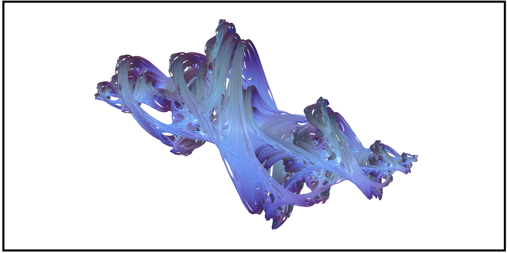
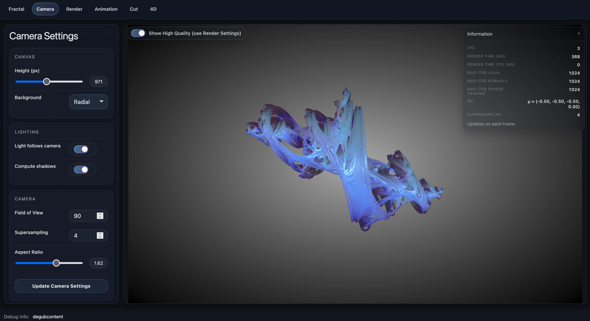
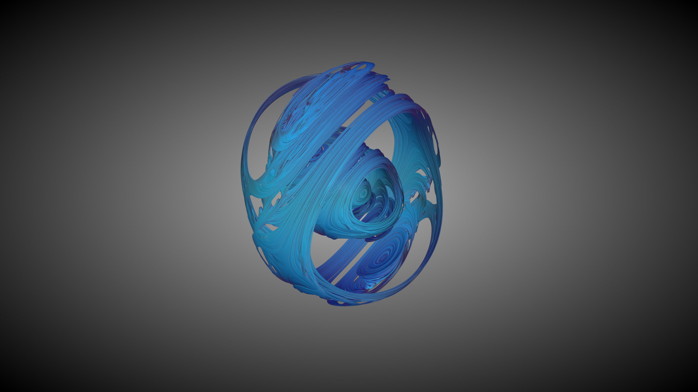
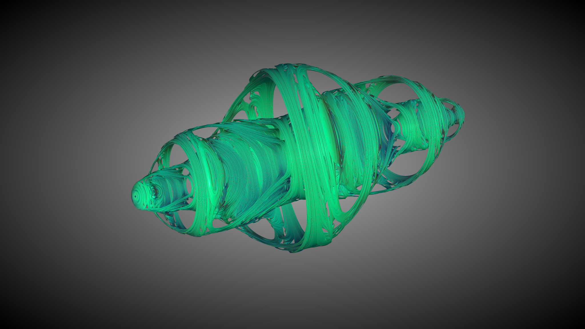
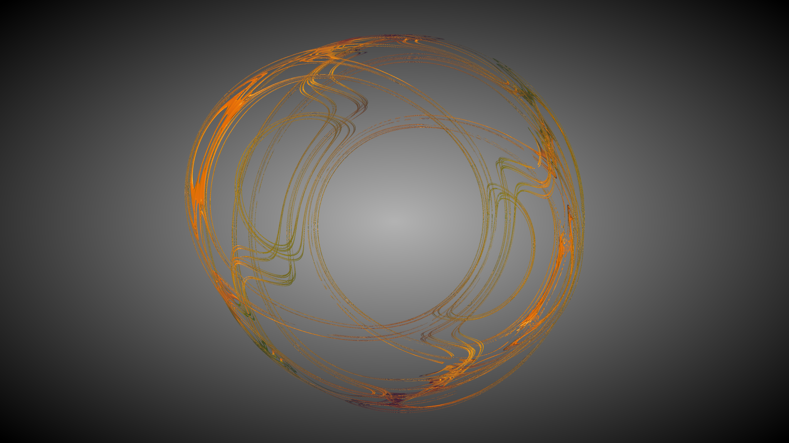

# Raytracing (4D) Julia Fractals (WebGL /GLSL)

## Description
A real-time WebGL implementation of quaternion Julia fractals using GLSL fragment shaders and sphere tracing.

This project implements sphere tracing, distance estimation, multiple normal computation techniques, and both 3D slice and 4D camera rendering.

The core contribution of this project is the GLSL fragment shader implementation for:
- Quaternion & CQuat Julia sets
- Squared and cubic iterations
- Distance estimation (Hart / Crane / Quilez based)
- Sphere tracing
- Three different normal estimation methods
- Optional 4D camera raytracing
- Real-time shading

The web application acts as an interactive frontend to explore the shader.

## Technical Overview

### Quaternion Julia Set

The fractal is defined via the iterative function:

$z_{n+1} = z_n^2 + \mu$

where $z \in \mathbb{H}$ (the quaternion space) and $\mu$ is a constant quaternion parameter.

This extends the classical complex Julia set into four-dimensional space.
Rendering is performed on the isosurface of a distance estimator, following the formulation described by Crane (2005) and Hart et al. (1989).

### Ray Tracing and Distance Estimation
Surface rendering is performed using sphere tracing, introduced by Hart (1996).

The algorithm:
1.	Intersects a bounding sphere
2.	Estimates the minimum distance to the fractal surface
3.	Advances the ray by this distance
4.	Repeats until convergence or escape

The distance estimator enables stable rendering of highly detailed implicit surfaces.

### Normal Estimation

Three different surface normal estimation methods are implemented:
- V1, based on Crane (2005)
- V2, based on Quilez (2001)
- V3, based on da Silva et al. (2021)

These methods allow comparison between computational cost and shading accuracy.

### 4D Camera Model

In addition to traditional 3D slice rendering, the application supports a 4D camera model, allowing ray tracing directly in $\mathbb{R}^4$.

The implementation follows ideas presented by Odegaard and Wennergren (2007).
This enables exploration of quaternion space beyond fixed 3D slices.

## Web Application

An interactive WebGL application is included to explore the shaders in real time.

#### The interface allows:
- Adjusting the quaternion parameter $\mu$
- Switching between squared and cubic Julia sets
- Selecting different normal estimation methods
- Controlling iteration depth and supersampling quality
- Enabling shadows and background modes
- Exploring both 3D slice rendering and full 4D camera mode

#### Camera Controls
- Mouse drag - Orbit camera
- Mouse wheel - Zoom
- Iteration controls - Adjust rendering quality
- High Quality toggle - Enable full iteration depth for final rendering

During interaction, rendering quality is temporarily reduced to maintain responsiveness.

## References
- Crane, K. (2005). *Ray tracing quaternion julia sets on the gpu.*
- Hart, J. C., Sandin, D. J., & Kauffman, L. H. (1989). *Ray tracing deterministic 3-D fractals. In Proceedings of the 16th annual conference on Computer graphics and interactive techniques* (pp. 289-296).
- Hart, J. C. (1996). Sphere tracing: A geometric method for the antialiased ray tracing of implicit surfaces. *The Visual Computer*, 12(10), 527-545.
- Odegaard, T., & Wennergren, J. (2007). *Raytracing 4D fractals, visualizing the four dimensional properties of the Julia set*. Rapport, Malardalen University.
- da Silva, V., Novello, T., Lopes, H., Velho, L. (2021). *Real-Time Rendering of Complex Fractals*. In: Marrs, A., Shirley, P., Wald, I. (eds) Ray Tracing Gems II. Apress, Berkeley, CA. https://doi.org/10.1007/978-1-4842-7185-8_33
- Quilez, I. (2001). *3D Julia sets*, https://iquilezles.org/articles/juliasets3d/

## Example Renders
### Example 1

### Example 2

### Example 3

### Example 4
